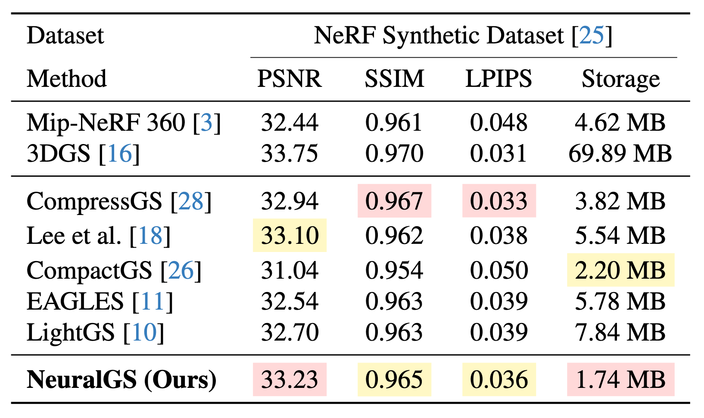

<h2 align="center"> 
  <a href="https://github.com/SuperFCR/NeuralGS"> NeuralGS: Bridging Neural Fields and 3D Gaussian Splatting for Compact 3D Representation</a>
</h2>
<h5 align="center"> 
If you like our project, please give us a star ⭐ on GitHub for latest update.  </h5>
<h5 align="center">

<!-- [](https://arxiv.org/) -->
[](https://github.com/SuperFCR/NeuralGS/blob/main/LICENSE) 
[](https://github.com/SuperFCR/NeuralGS/stargazers)&#160;
[](https://github.com/SuperFCR/NeuralGS/network)&#160;
[](https://github.com/SuperFCR/NeuralGS/watchers)&#160;


</h5>Implemetation of Bridging Neural Fields and 3D Gaussian Splatting for Compact 3D Representation.


## 🗓️ TODO
We will update the following list after the paper is accepted.
- [x] [2024-12-24] We have released our [project page](http://www.falcary.com/NeuralGS/).
- [ ] We have uploaded our paper, NeuralGS on [arXiv-Coming soon!]()
- [ ] Upload the code

## 🍭 Novel and Deblurring View Synthesis Results
### 🌅 Qualitative comparison


### 📊 Quantitative comparison


<div class="is-centered">
    <figure style="text-align: center;">
        <figcaption style="text-align: center; margin-top: 0.5rem;"> Table 1. Quantitative results evaluated on <em>Mip-NeRF 360, Tanks&Temples, and Deep Blending</em> datasets. We highlight the best-performing results in <span style="color: red;">red</span> and the second-best results in <span style="color: #e9d600;">yellow</span> for all compression methods </figcaption>
        
    </figure>
</div>
<!--  -->
<!-- 

 -->
<table>
  <tr>
    <td style="width: 45%; vertical-align: top; padding-right: 10px;">
      
      <p style="text-align: center;">Table 2. Quantitative results of the proposed method evaluated on the <em>NeRF-Synthetic</em> dataset. We highlight the best-performing results in <span style="color: red;">red</span> and the second-best results in <span style="color: #e9d600;">yellow</span> for all compression methods.</p>
    </td>
    <td style="width: 55%; vertical-align: top;">
      <div style="margin-bottom: 20px;">
        
        <p style="text-align: center;">Table 3. Performance comparison with 3DGS. Rendering FPS and model size (MB) are reported. The rendering speed of both methods is measured on our machine.</p>
      </div>
      <div>
        
        <p style="text-align: center;">Table 4. Quantitative ablation study on the <em>Deep Blending</em> dataset by progressively adding our proposed improvement.</p>
      </div>
    </td>
  </tr>
</table>

<!-- <h2>
  
  Acknowledgements
</h2> -->
## 🙏 Acknowledgements

This source code is derived from multiple sources, in particular: 
[gaussian-splatting](https://github.com/graphdeco-inria/gaussian-splatting/tree/main). We thank the authors for releasing their code.

```bibtex

To be contunied...

```


## 🤝 Contributors

<a href="https://github.com/SuperFCR/NeuralGS/graphs/contributors">
  
</a>
